## Configuration of Databricks Compute Cluster

Visit on the website https://www.databricks.com/ and following the sequence provided in screenshots

  
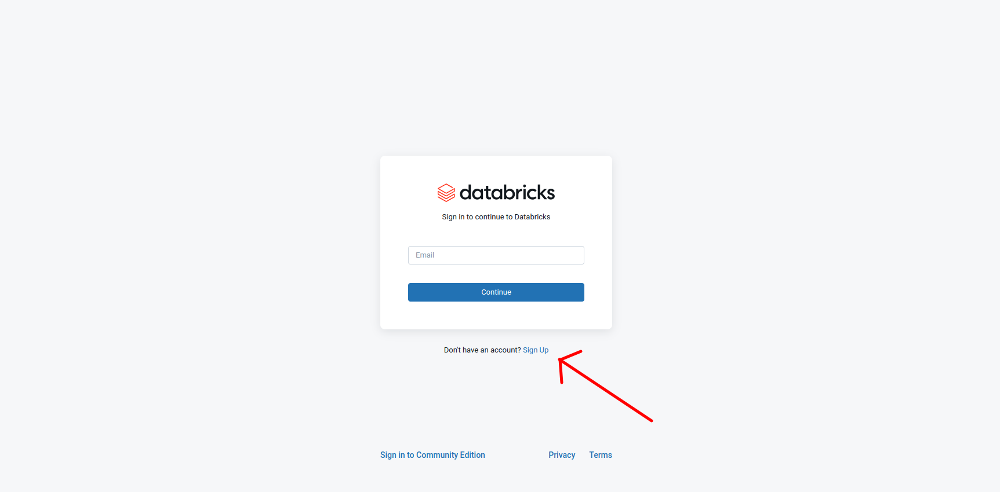
  

  

  

  
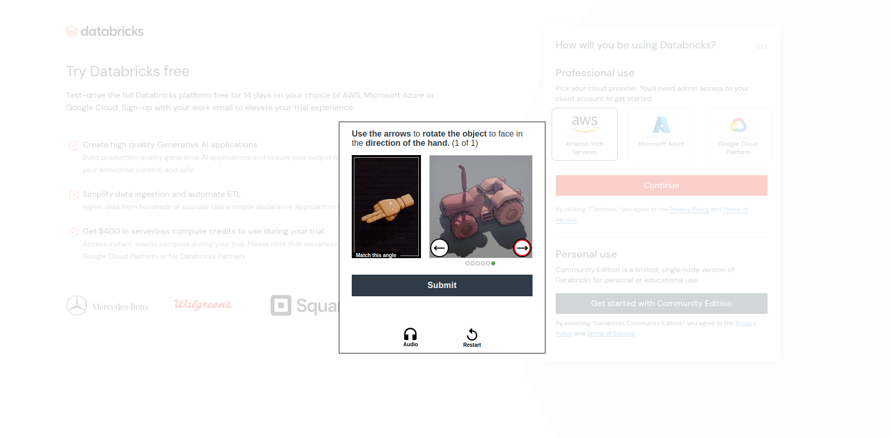
  

  
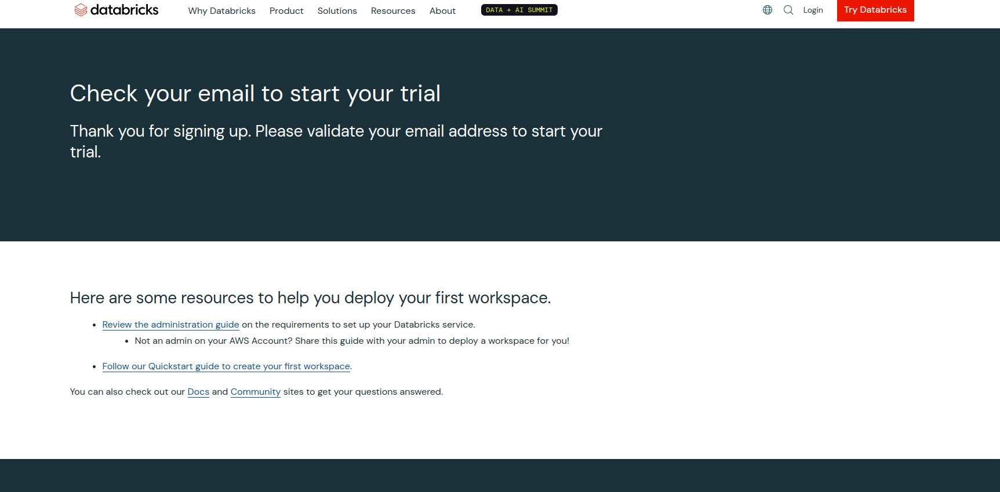
  
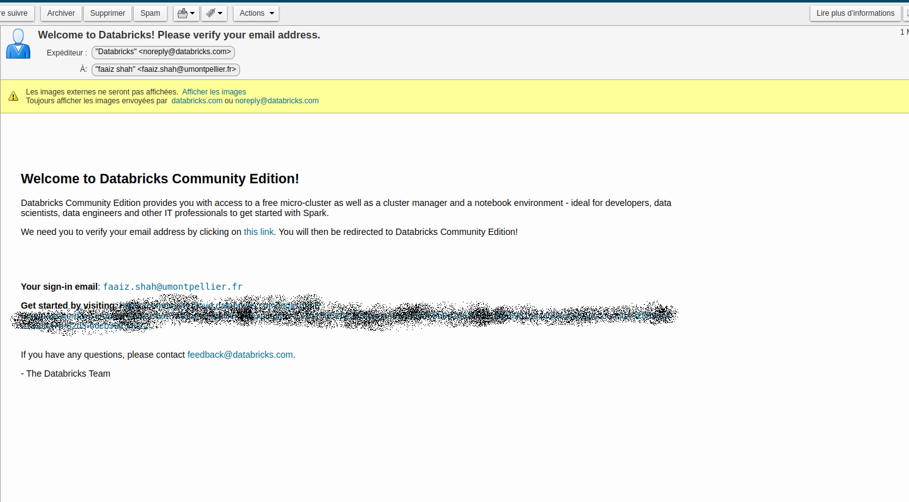
  
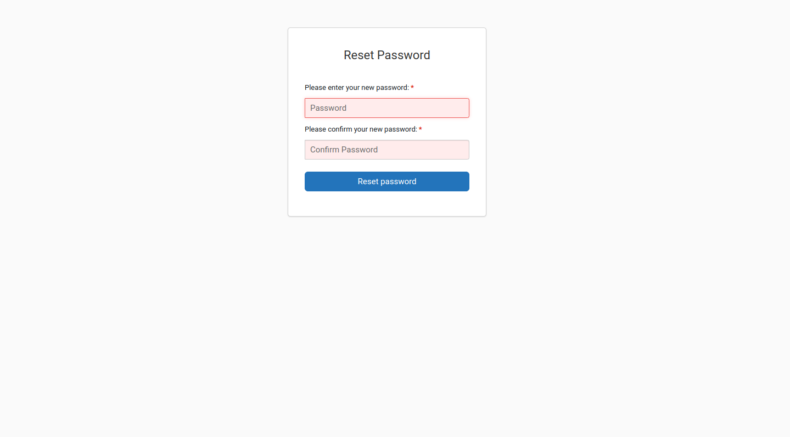
  
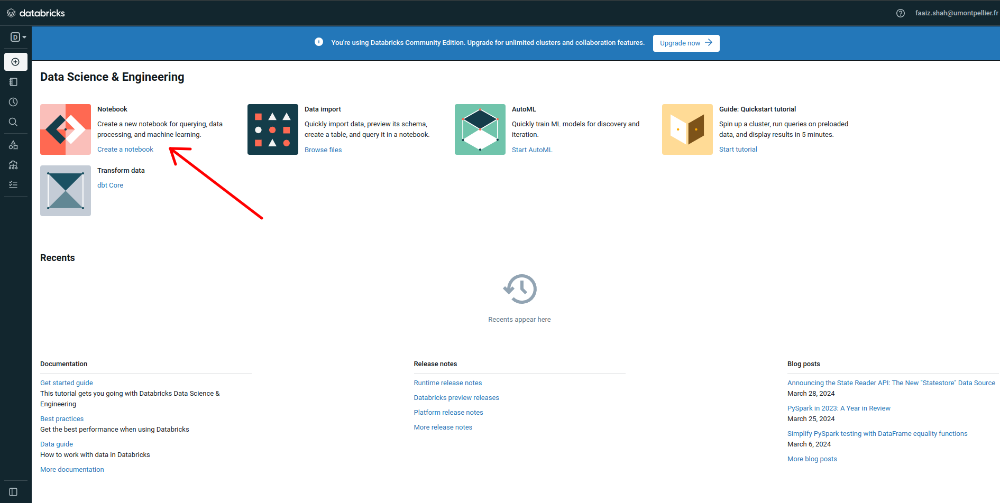
  
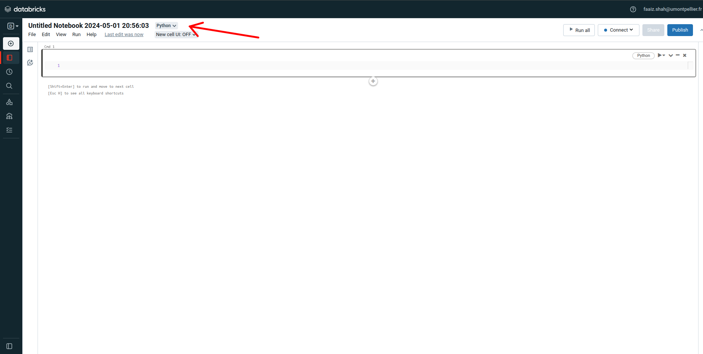
  
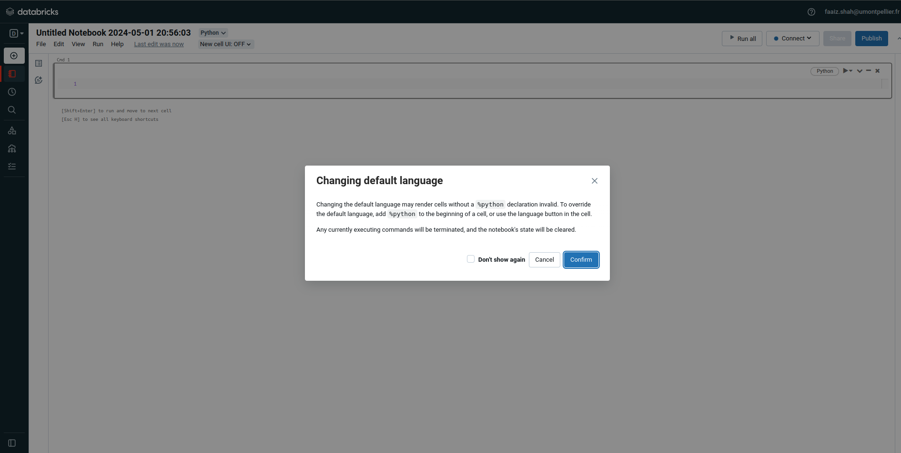
  
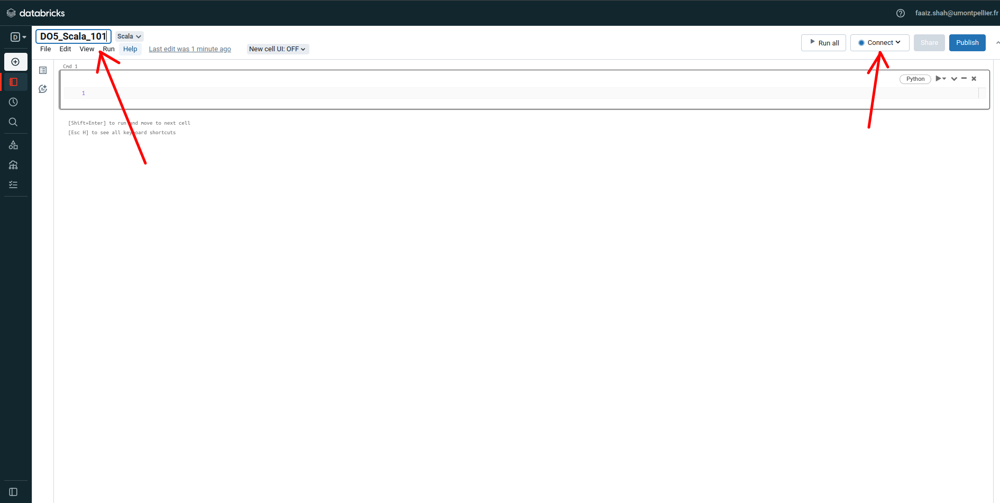
  
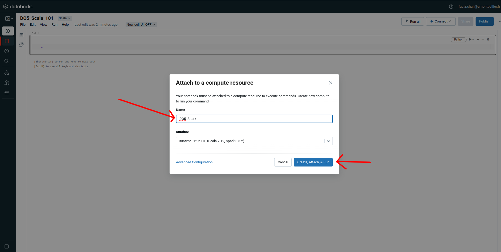
  
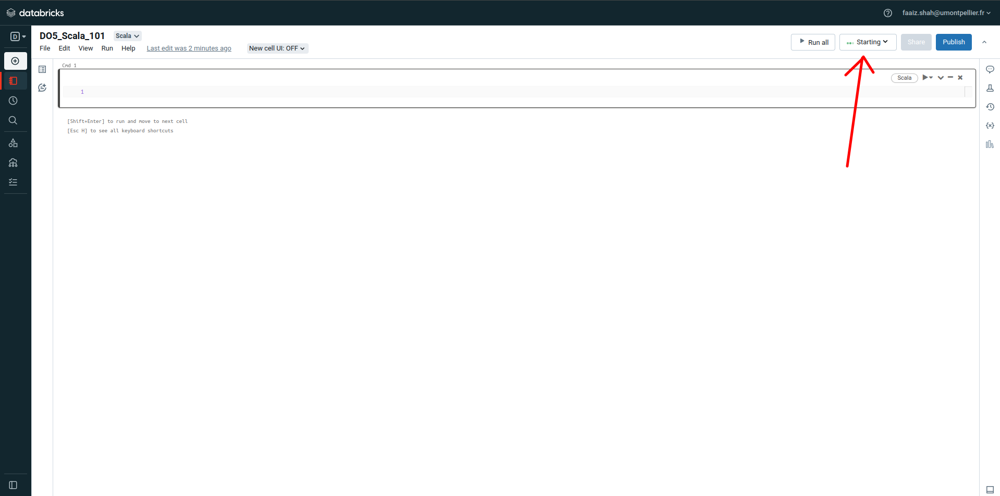
  

  

Thank you